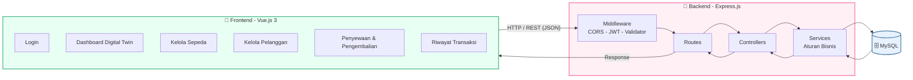
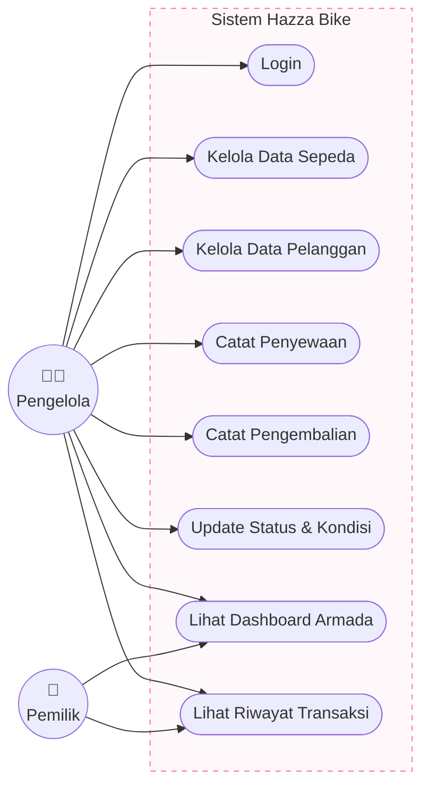
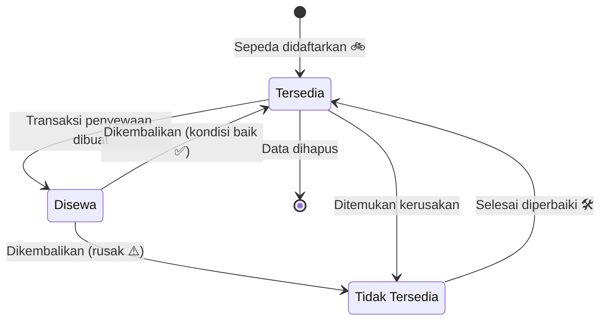
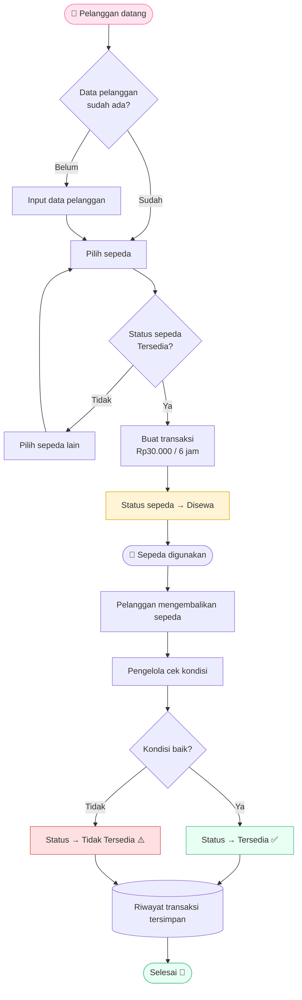
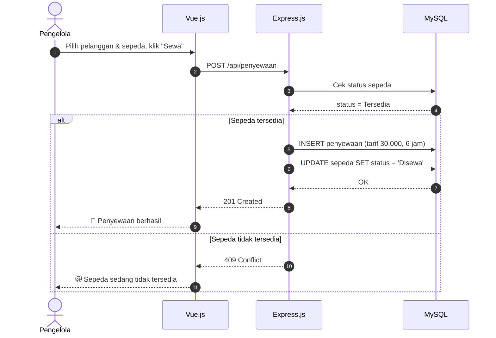
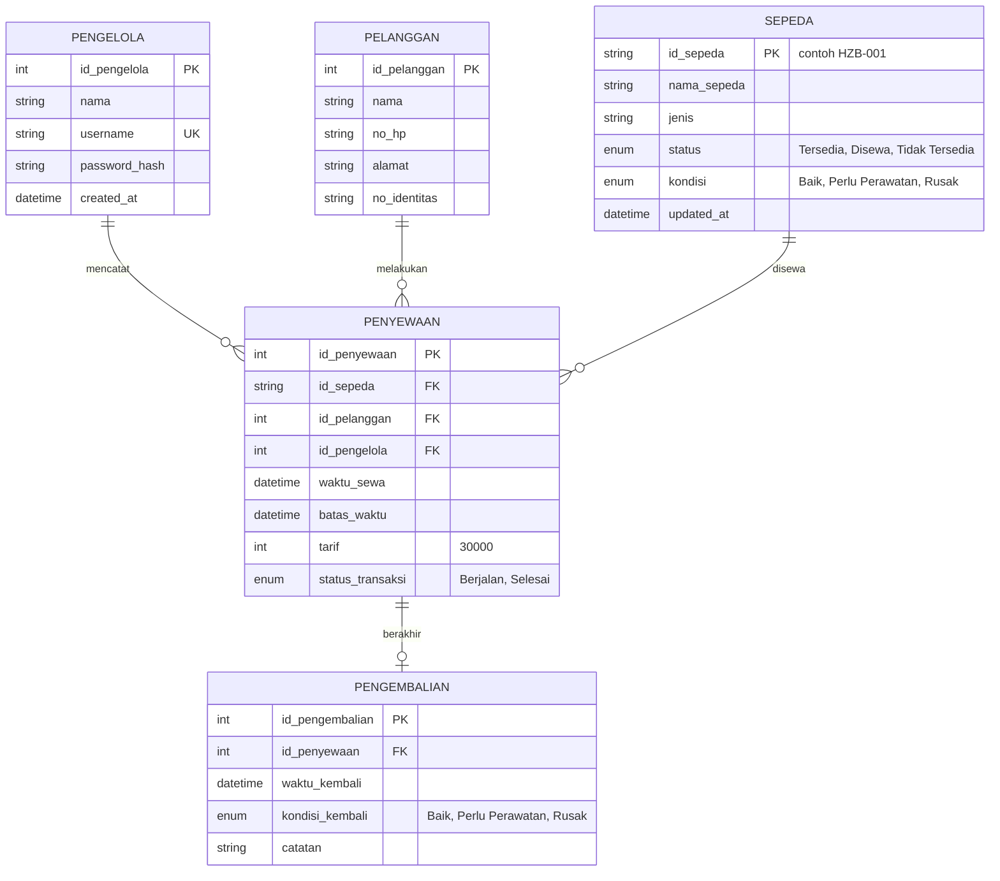
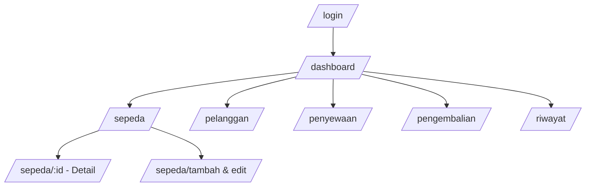
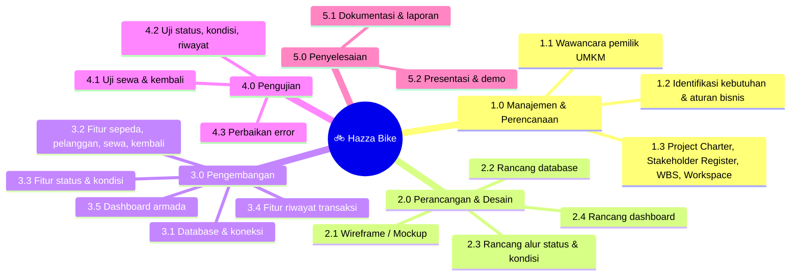
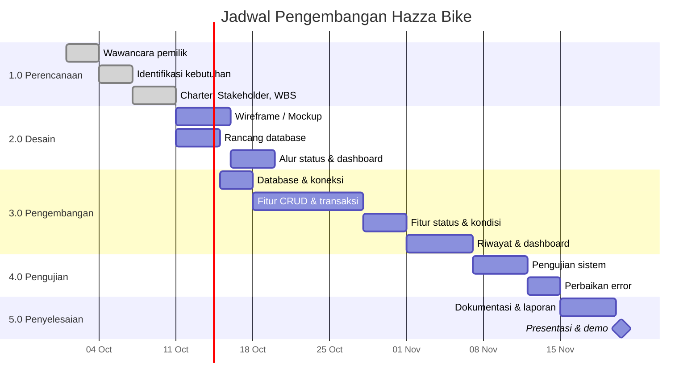
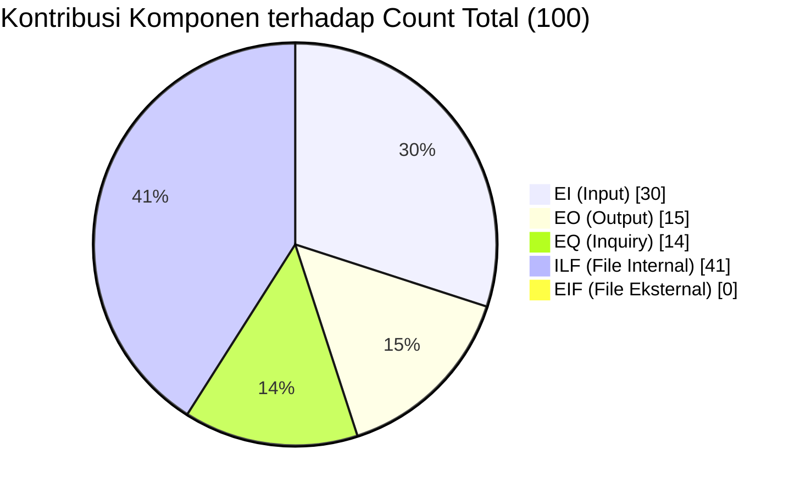

<div align="center">


<a href="https://git.io/typing-svg">
  
</a>

<br/>


</div>

---

## 📖 Daftar Isi

- [Tentang Proyek](#-tentang-proyek)
- [Tujuan Proyek](#-tujuan-proyek)
- [Fitur Utama](#-fitur-utama)
- [Ruang Lingkup](#-ruang-lingkup)
- [Aturan Bisnis](#-aturan-bisnis)
- [Tim Pengembang](#-tim-pengembang)
- [Stakeholder](#-stakeholder)
- [Arsitektur Sistem](#-arsitektur-sistem)
- [Diagram](#-diagram)
- [WBS & Jadwal](#-wbs--jadwal)
- [Estimasi Function Point](#-estimasi-function-point)
- [Tech Stack](#-tech-stack)
- [Struktur Folder](#-struktur-folder)
- [Cara Menjalankan](#-cara-menjalankan)
- [Dokumentasi API](#-dokumentasi-api)
- [Animasi Lucu di Frontend](#-animasi-lucu-di-frontend)
- [Pengujian](#-pengujian)
- [Dokumentasi Survey](#-dokumentasi-survey-lapangan)

---

## 🌸 Tentang Proyek

**Hazza Bike** adalah usaha penyewaan sepeda. Berdasarkan wawancara dengan pemilik, proses penyewaan melibatkan data **sepeda**, **pelanggan**, **transaksi penyewaan**, **tarif**, dan **kondisi sepeda**.

Proyek ini membangun sistem **Digital Twin berbasis web** yang merepresentasikan status dan kondisi sepeda dunia nyata ke dalam bentuk digital, sehingga pemilik dan petugas dapat mengelola armada, penyewaan, pengembalian, dan riwayat transaksi secara terstruktur.

> 💰 **Tarif:** Rp30.000 untuk durasi 6 jam.

## 🎯 Tujuan Proyek

1. Membangun sistem Digital Twin berbasis web untuk mengelola dan merepresentasikan data, status, dan kondisi armada sepeda Hazza Bike.
2. Menyediakan fitur pengelolaan pelanggan, penyewaan, pengembalian, dan riwayat transaksi.
3. Menyediakan dashboard ketersediaan, status, dan kondisi sepeda sehingga perubahan di dunia nyata tercermin di sistem.

## ✨ Fitur Utama

| | Fitur | Keterangan |
|---|---|---|
| 🔐 | Login Pengelola | Autentikasi petugas dengan username & password |
| 🚲 | Manajemen Sepeda | Tambah, edit, hapus, lihat daftar & detail sepeda (ID unik) |
| 🧑‍🤝‍🧑 | Manajemen Pelanggan | Input dan lihat data pelanggan |
| 🧾 | Transaksi Penyewaan | Catat sewa, hubungkan pelanggan + sepeda, tarif Rp30.000 / 6 jam |
| 🔁 | Pengembalian | Catat pengembalian & kondisi sepeda saat kembali |
| 🛠️ | Status & Kondisi | Update status (Tersedia / Disewa / Tidak Tersedia) dan kondisi |
| 📜 | Riwayat Transaksi | Riwayat penyewaan tersimpan dan bisa dilihat |
| 📊 | Dashboard Digital Twin | Ringkasan status dan kondisi seluruh armada |

## 🧭 Ruang Lingkup

| ✅ In-Scope | ❌ Out-of-Scope |
|---|---|
| Pengelolaan data sepeda & ID sepeda | Pelacakan lokasi GPS real-time |
| Pengelolaan status & kondisi sepeda | Payment gateway / pembayaran online otomatis |
| Pengelolaan data pelanggan | Integrasi aplikasi pihak ketiga |
| Pencatatan transaksi penyewaan | Pengembangan perangkat IoT |
| Pencatatan pengembalian | Sistem penjualan sepeda |
| Pencatatan riwayat transaksi | Pengelolaan usaha lain di luar penyewaan |
| Dashboard Digital Twin armada | |
| Tarif Rp30.000 / 6 jam | |
| Representasi perubahan kondisi dunia nyata ke data digital | |

## 📏 Aturan Bisnis

- [x] Setiap sepeda memiliki **ID unik**.
- [x] Setiap sepeda memiliki **status ketersediaan** dan **kondisi**.
- [x] Tarif sewa **Rp30.000 untuk 6 jam**.
- [x] Sepeda berstatus **"Disewa"** tidak dapat disewa pelanggan lain pada waktu yang sama.
- [x] Setiap transaksi harus terhubung dengan **data pelanggan** dan **data sepeda**.
- [x] Sepeda yang dikembalikan berstatus **"Tersedia"** jika kondisinya masih baik.
- [x] Sepeda yang rusak dapat berstatus **"Tidak Tersedia"** sampai diperbaiki.
- [x] Riwayat transaksi disimpan di sistem.
- [x] Perubahan status & kondisi di dunia nyata harus direpresentasikan di data Digital Twin.

## 👩‍💻 Tim Pengembang

| Nama | Peran |
|---|---|
| **Darma** | Project Manager |
| **Hilda Natasya** | System Analyst |
| **Difana Syakila** | UI/UX Designer |
| **Aulia Yudistira** | Developer |

**Dosen / Supervisor:** Ibu Cut Alna Fadillah

## 👥 Stakeholder

| ID | Stakeholder | Peran | Kategori | Interest | Influence |
|---|---|---|---|---|---|
| S01 | Pemilik Hazza Bike | Owner | Internal / Business | High | High |
| S02 | Pengelola / Petugas | Operational Staff | Internal / Business | High | High |
| S03 | Pelanggan | End User | External | Medium | Medium |
| S04 | Darma | Project Manager | Internal / Project Team | High | Medium |
| S05 | Hilda Natasya | System Analyst | Internal / Project Team | High | Medium |
| S06 | Difana Syakila | UI/UX Designer | Internal / Project Team | High | Medium |
| S07 | Aulia Yudistira | Developer | Internal / Project Team | High | Medium |
| S08 | Ibu Cut Alna Fadillah | Dosen / Supervisor | External / Academic | High | High |

---

## 🏗️ Arsitektur Sistem



## 📊 Diagram

### 1. Use Case



### 2. Siklus Status Sepeda (Digital Twin)



### 3. Alur Penyewaan & Pengembalian



### 4. Sequence Diagram - Penyewaan



### 5. ERD (Entity Relationship Diagram)



> 💡 **Riwayat transaksi** diambil dari gabungan tabel `penyewaan` + `pengembalian` (bukan tabel terpisah), sesuai perhitungan Function Point (5 ILF).

### 6. Struktur Halaman Frontend



---

## 🗓️ WBS & Jadwal

### Work Breakdown Structure



### Contoh Jadwal (Gantt)

> ⚠️ Tanggal di bawah hanya **contoh**. Sesuaikan dengan jadwal tim.



---

## 📐 Estimasi Function Point

### Komposisi Weighted Count



### Rekapitulasi

| Komponen | Low | Average | High | Total |
|---|---|---|---|---|
| External Input (EI) | 6 × 3 = 18 | 3 × 4 = 12 | 0 | **30** |
| External Output (EO) | 0 | 3 × 5 = 15 | 0 | **15** |
| External Inquiry (EQ) | 2 × 3 = 6 | 2 × 4 = 8 | 0 | **14** |
| Internal Logical File (ILF) | 3 × 7 = 21 | 2 × 10 = 20 | 0 | **41** |
| External Interface File (EIF) | 0 | 0 | 0 | **0** |
| **Count Total** | | | | **100** |

### Complexity Adjustment (ΣFi = 25)

| Faktor | Nilai | Faktor | Nilai |
|---|---|---|---|
| F1 Data Communications | 3 | F8 Online Update | 3 |
| F2 Distributed Data Processing | 0 | F9 Complex Processing | 1 |
| F3 Performance | 2 | F10 Reusability | 1 |
| F4 Heavily Used Configuration | 1 | F11 Installation Ease | 2 |
| F5 Transaction Rate | 2 | F12 Operational Ease | 2 |
| F6 Online Data Entry | 3 | F13 Multiple Sites | 0 |
| F7 End-User Efficiency | 3 | F14 Facilitate Change | 2 |

```
VAF = 0,65 + (0,01 × ΣFi) = 0,65 + 0,25 = 0,90
FP  = Count Total × VAF   = 100 × 0,90   = 90 FP
```

> 🎀 **Hasil akhir: 90 Function Point.**

---

## 🧰 Tech Stack

| Layer | Teknologi |
|---|---|
| Frontend | Vue.js 3 (Composition API), Vue Router, Pinia, Axios, Vite |
| UI & Animasi | CSS Keyframes, `<Transition>`, Animate.css / `@vueuse/motion` (opsional), Chart.js (`vue-chartjs`) |
| Backend | Node.js, Express.js |
| Database | MySQL (`mysql2`) - dapat diganti sesuai kebutuhan tim |
| Auth | JWT + bcrypt |
| Validasi | express-validator / Joi |

## 📁 Struktur Folder

```
hazza-bike/
├── assets/
│   └── bike-banner.svg
├── backend/
│   ├── src/
│   │   ├── config/          # koneksi database, env
│   │   ├── controllers/     # sepeda, pelanggan, penyewaan, pengembalian, auth
│   │   ├── middlewares/     # auth JWT, error handler, validator
│   │   ├── routes/
│   │   ├── services/        # aturan bisnis (cek status, hitung tarif)
│   │   └── app.js
│   ├── database/
│   │   └── schema.sql
│   ├── .env.example
│   └── package.json
├── frontend/
│   ├── src/
│   │   ├── api/             # axios instance
│   │   ├── assets/          # gambar, css animasi
│   │   ├── components/      # BikeCard, StatusBadge, StatCard, ...
│   │   ├── layouts/
│   │   ├── router/
│   │   ├── stores/          # Pinia
│   │   ├── views/           # Dashboard, Sepeda, Pelanggan, Penyewaan, ...
│   │   └── main.js
│   ├── .env.example
│   └── package.json
└── README.md
```

## 🚀 Cara Menjalankan

### Prasyarat

- Node.js 20+
- MySQL 8+
- Git

### 1. Clone repository

```bash
git clone https://github.com/<username>/hazza-bike.git
cd hazza-bike
```

### 2. Setup database

```bash
mysql -u root -p -e "CREATE DATABASE hazza_bike;"
mysql -u root -p hazza_bike < backend/database/schema.sql
```

Contoh `schema.sql`:

```sql
CREATE TABLE pengelola (
  id_pengelola INT AUTO_INCREMENT PRIMARY KEY,
  nama VARCHAR(100) NOT NULL,
  username VARCHAR(50) NOT NULL UNIQUE,
  password_hash VARCHAR(255) NOT NULL,
  created_at DATETIME DEFAULT CURRENT_TIMESTAMP
);

CREATE TABLE sepeda (
  id_sepeda VARCHAR(20) PRIMARY KEY,           -- contoh: HZB-001
  nama_sepeda VARCHAR(100) NOT NULL,
  jenis VARCHAR(50),
  status ENUM('Tersedia','Disewa','Tidak Tersedia') DEFAULT 'Tersedia',
  kondisi ENUM('Baik','Perlu Perawatan','Rusak') DEFAULT 'Baik',
  updated_at DATETIME DEFAULT CURRENT_TIMESTAMP ON UPDATE CURRENT_TIMESTAMP
);

CREATE TABLE pelanggan (
  id_pelanggan INT AUTO_INCREMENT PRIMARY KEY,
  nama VARCHAR(100) NOT NULL,
  no_hp VARCHAR(20),
  alamat TEXT,
  no_identitas VARCHAR(50)
);

CREATE TABLE penyewaan (
  id_penyewaan INT AUTO_INCREMENT PRIMARY KEY,
  id_sepeda VARCHAR(20) NOT NULL,
  id_pelanggan INT NOT NULL,
  id_pengelola INT NOT NULL,
  waktu_sewa DATETIME DEFAULT CURRENT_TIMESTAMP,
  batas_waktu DATETIME NOT NULL,
  tarif INT NOT NULL DEFAULT 30000,
  status_transaksi ENUM('Berjalan','Selesai') DEFAULT 'Berjalan',
  FOREIGN KEY (id_sepeda) REFERENCES sepeda(id_sepeda),
  FOREIGN KEY (id_pelanggan) REFERENCES pelanggan(id_pelanggan),
  FOREIGN KEY (id_pengelola) REFERENCES pengelola(id_pengelola)
);

CREATE TABLE pengembalian (
  id_pengembalian INT AUTO_INCREMENT PRIMARY KEY,
  id_penyewaan INT NOT NULL UNIQUE,
  waktu_kembali DATETIME DEFAULT CURRENT_TIMESTAMP,
  kondisi_kembali ENUM('Baik','Perlu Perawatan','Rusak') NOT NULL,
  catatan TEXT,
  FOREIGN KEY (id_penyewaan) REFERENCES penyewaan(id_penyewaan)
);
```

### 3. Jalankan Backend (Express.js)

```bash
cd backend
cp .env.example .env
npm install
npm run dev
```

`.env`:

```env
PORT=5000
DB_HOST=localhost
DB_USER=root
DB_PASSWORD=
DB_NAME=hazza_bike
JWT_SECRET=ganti_dengan_secret_yang_aman
TARIF_6_JAM=30000
```

### 4. Jalankan Frontend (Vue.js)

```bash
cd frontend
cp .env.example .env
npm install
npm run dev
```

`.env`:

```env
VITE_API_URL=http://localhost:5000/api
```

Buka **http://localhost:5173** 🎉

## 🔌 Dokumentasi API

Base URL: `http://localhost:5000/api`  (semua endpoint kecuali login memerlukan header `Authorization: Bearer <token>`)

| Method | Endpoint | Fungsi | FP |
|---|---|---|---|
| POST | `/auth/login` | Login pengelola | EI-01 |
| GET | `/sepeda` | Daftar sepeda | EQ-01 |
| GET | `/sepeda/:id` | Detail sepeda | EQ-02 |
| POST | `/sepeda` | Tambah sepeda | EI-02 |
| PUT | `/sepeda/:id` | Edit sepeda | EI-03 |
| DELETE | `/sepeda/:id` | Hapus sepeda | EI-04 |
| PATCH | `/sepeda/:id/status` | Update status | EI-09 |
| PATCH | `/sepeda/:id/kondisi` | Update kondisi | EI-08 |
| GET | `/pelanggan` | Daftar pelanggan | EQ-03 |
| POST | `/pelanggan` | Input pelanggan | EI-05 |
| POST | `/penyewaan` | Buat transaksi sewa | EI-06 |
| GET | `/penyewaan/:id` | Informasi transaksi | EO-02 |
| POST | `/pengembalian` | Catat pengembalian | EI-07 |
| GET | `/riwayat` | Riwayat penyewaan | EO-03, EQ-04 |
| GET | `/dashboard/armada` | Ringkasan status & kondisi armada | EO-01 |

### Contoh: Buat Penyewaan

**Request**

```http
POST /api/penyewaan
Content-Type: application/json

{
  "id_sepeda": "HZB-001",
  "id_pelanggan": 3
}
```

**Response `201`**

```json
{
  "message": "Penyewaan berhasil dibuat",
  "data": {
    "id_penyewaan": 12,
    "id_sepeda": "HZB-001",
    "tarif": 30000,
    "waktu_sewa": "2026-10-03T09:00:00.000Z",
    "batas_waktu": "2026-10-03T15:00:00.000Z"
  }
}
```

**Response `409`** (sepeda tidak tersedia)

```json
{ "message": "Sepeda sedang disewa atau tidak tersedia" }
```

### Contoh Logika Aturan Bisnis (Express)

```js
// backend/src/services/penyewaan.service.js
const db = require('../config/db');
const TARIF = Number(process.env.TARIF_6_JAM || 30000);
const DURASI_JAM = 6;

exports.buatPenyewaan = async ({ id_sepeda, id_pelanggan, id_pengelola }) => {
  const conn = await db.getConnection();
  try {
    await conn.beginTransaction();

    const [[sepeda]] = await conn.query(
      'SELECT status FROM sepeda WHERE id_sepeda = ? FOR UPDATE',
      [id_sepeda]
    );
    if (!sepeda) throw { status: 404, message: 'Sepeda tidak ditemukan' };
    if (sepeda.status !== 'Tersedia')
      throw { status: 409, message: 'Sepeda sedang disewa atau tidak tersedia' };

    const [hasil] = await conn.query(
      `INSERT INTO penyewaan (id_sepeda, id_pelanggan, id_pengelola, batas_waktu, tarif)
       VALUES (?, ?, ?, DATE_ADD(NOW(), INTERVAL ? HOUR), ?)`,
      [id_sepeda, id_pelanggan, id_pengelola, DURASI_JAM, TARIF]
    );

    await conn.query("UPDATE sepeda SET status = 'Disewa' WHERE id_sepeda = ?", [id_sepeda]);

    await conn.commit();
    return { id_penyewaan: hasil.insertId, tarif: TARIF };
  } catch (err) {
    await conn.rollback();
    throw err;
  } finally {
    conn.release();
  }
};
```

---

## 🎀 Animasi Lucu di Frontend

Supaya website terasa **cute & friendly**, berikut ide dan contoh siap pakai.

### Palet Warna Saran

| Warna | Hex | Pemakaian |
|---|---|---|
| 🌸 Pink | `#FF6FA5` | Aksen utama, tombol |
| 🍃 Mint | `#42B883` | Status "Tersedia" |
| 🌼 Kuning | `#FFD966` | Status "Disewa" |
| 🍓 Merah muda | `#FF8A8A` | Status "Tidak Tersedia" |
| ☁️ Langit | `#BDE7FF` | Latar / kartu |

### `frontend/src/assets/cute.css`

```css
:root {
  --pink: #ff6fa5;
  --mint: #42b883;
  --yellow: #ffd966;
  --coral: #ff8a8a;
  --sky: #bde7ff;
}

/* Sepeda berjalan di header */
@keyframes ride {
  from { transform: translateX(-120px); }
  to   { transform: translateX(110vw); }
}
.bike-ride { animation: ride 9s linear infinite; }

/* Melompat lucu */
@keyframes bounce-cute {
  0%, 100% { transform: translateY(0) scale(1, 1); }
  40%      { transform: translateY(-14px) scale(0.97, 1.05); }
  60%      { transform: translateY(0) scale(1.05, 0.95); }
}
.bounce { animation: bounce-cute 1.4s ease-in-out infinite; }

/* Goyang saat hover */
@keyframes wiggle {
  0%, 100% { transform: rotate(0); }
  25% { transform: rotate(-4deg); }
  75% { transform: rotate(4deg); }
}
.card-cute {
  border-radius: 20px;
  background: #fff;
  box-shadow: 0 6px 18px rgba(255, 111, 165, 0.18);
  transition: transform .25s ease, box-shadow .25s ease;
}
.card-cute:hover {
  animation: wiggle .5s ease;
  transform: translateY(-4px);
  box-shadow: 0 12px 26px rgba(255, 111, 165, 0.3);
}

/* Denyut untuk badge "Disewa" */
@keyframes pulse-soft {
  0%   { box-shadow: 0 0 0 0 rgba(255, 217, 102, .7); }
  70%  { box-shadow: 0 0 0 12px rgba(255, 217, 102, 0); }
  100% { box-shadow: 0 0 0 0 rgba(255, 217, 102, 0); }
}
.badge-disewa { animation: pulse-soft 1.8s infinite; }

/* Hati melayang */
@keyframes float-heart {
  0%   { transform: translateY(0) scale(.8); opacity: 0; }
  20%  { opacity: 1; }
  100% { transform: translateY(-80px) scale(1.2); opacity: 0; }
}
.heart { position: absolute; animation: float-heart 2.4s ease-out forwards; }

/* Transisi halaman */
.page-enter-active, .page-leave-active { transition: all .35s cubic-bezier(.34, 1.56, .64, 1); }
.page-enter-from { opacity: 0; transform: translateY(20px) scale(.97); }
.page-leave-to   { opacity: 0; transform: translateY(-20px) scale(.97); }
```

### Transisi Antar Halaman (`App.vue`)

```vue
<script setup>
import '@/assets/cute.css';
</script>

<template>
  <RouterView v-slot="{ Component }">
    <Transition name="page" mode="out-in">
      <component :is="Component" />
    </Transition>
  </RouterView>
</template>
```

### Komponen Kartu Sepeda (`BikeCard.vue`)

```vue
<script setup>
defineProps({ sepeda: Object });

const warna = {
  'Tersedia': 'var(--mint)',
  'Disewa': 'var(--yellow)',
  'Tidak Tersedia': 'var(--coral)',
};
const emoji = { 'Tersedia': '😸', 'Disewa': '🚴', 'Tidak Tersedia': '🛠️' };
</script>

<template>
  <div class="card-cute bike-card">
    <div class="bike-icon bounce">🚲</div>
    <h3>{{ sepeda.nama_sepeda }}</h3>
    <small>{{ sepeda.id_sepeda }}</small>

    <span
      class="badge"
      :class="{ 'badge-disewa': sepeda.status === 'Disewa' }"
      :style="{ background: warna[sepeda.status] }"
    >
      {{ emoji[sepeda.status] }} {{ sepeda.status }}
    </span>

    <p>Kondisi: <b>{{ sepeda.kondisi }}</b></p>
  </div>
</template>

<style scoped>
.bike-card { padding: 20px; text-align: center; }
.bike-icon { font-size: 40px; }
.badge { display: inline-block; padding: 4px 14px; border-radius: 999px; font-weight: 600; color: #fff; }
</style>
```

### Animasi Angka Dashboard (`StatCard.vue`)

```vue
<script setup>
import { ref, watch, onMounted } from 'vue';

const props = defineProps({ label: String, value: Number, icon: String });
const tampil = ref(0);

function hitung(ke) {
  const mulai = tampil.value;
  const durasi = 800;
  const t0 = performance.now();
  const step = (t) => {
    const p = Math.min((t - t0) / durasi, 1);
    tampil.value = Math.round(mulai + (ke - mulai) * p);
    if (p < 1) requestAnimationFrame(step);
  };
  requestAnimationFrame(step);
}

onMounted(() => hitung(props.value));
watch(() => props.value, hitung);
</script>

<template>
  <div class="card-cute stat">
    <div class="bounce">{{ icon }}</div>
    <h2>{{ tampil }}</h2>
    <p>{{ label }}</p>
  </div>
</template>
```

### Ide Animasi Tambahan

| Lokasi | Animasi |
|---|---|
| Halaman login | Sepeda lewat di bawah form (`.bike-ride`) |
| Dashboard | Angka naik perlahan, kartu muncul bergantian (`animation-delay`) |
| Sukses sewa | Hati / confetti melayang 🎉 (`canvas-confetti`) |
| Sepeda rusak | Ikon obeng goyang pelan |
| Tabel kosong | Maskot sepeda tidur 😴 + teks "Belum ada data" |
| Loading | Roda sepeda berputar (SVG `rotate`) |
| Toast | Notifikasi muncul memantul dari kanan atas |

> 💡 Hormati pengguna yang sensitif terhadap gerakan: tambahkan
> ```css
> @media (prefers-reduced-motion: reduce) { * { animation: none !important; transition: none !important; } }
> ```

---

## 🧪 Pengujian

| ID | Skenario | Hasil yang Diharapkan |
|---|---|---|
| T-01 | Login dengan akun valid | Masuk ke dashboard |
| T-02 | Tambah sepeda dengan ID baru | Data tersimpan, status awal "Tersedia" |
| T-03 | Tambah sepeda dengan ID duplikat | Ditolak (ID harus unik) |
| T-04 | Sewa sepeda "Tersedia" | Transaksi dibuat, status → "Disewa", tarif Rp30.000 |
| T-05 | Sewa sepeda "Disewa" | Ditolak (409) |
| T-06 | Sewa sepeda "Tidak Tersedia" | Ditolak (409) |
| T-07 | Kembalikan sepeda kondisi baik | Status → "Tersedia" |
| T-08 | Kembalikan sepeda kondisi rusak | Status → "Tidak Tersedia" |
| T-09 | Perbaikan selesai, status diubah manual | Status → "Tersedia" |
| T-10 | Lihat riwayat transaksi | Semua transaksi tampil lengkap |
| T-11 | Dashboard setelah perubahan status | Jumlah per status ter-update |

## 📸 Dokumentasi Survey Lapangan

Survei dan wawancara dilakukan langsung di toko **Hazza Bike** (Jalan Murni, Gampong Sidodadi). Letakkan foto dokumentasi pada folder `assets/` lalu tampilkan di sini:

```md


```

---

<div align="center">

### 💖 Dibuat dengan semangat oleh Tim Hazza Bike 💖

**Darma • Hilda Natasya • Difana Syakila • Aulia Yudistira**

<sub>Dosen Pembimbing: Ibu Cut Alna Fadillah</sub>


</div>
